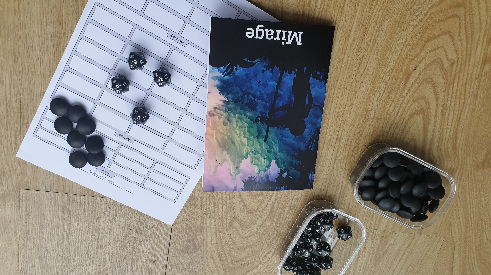

import { Link } from "gatsby"

# Pen and Paper

All you need to play the pen-and-paper version of Mirage is printed out character sheets, some 20-sided dice (ideally 4 per player, but you can get by with just 4 dice for the whole group), and something to use as vitality tokens (poker chips, coins, pieces of paper). You can also print out the paper version of the rules (or just use the online version).

[Printable Character Sheet](/files/CharacterSheet.pdf).

[Printable Rules](/files/Mirage.pdf) (for regular A4 paper).

[Printable Rules](/files/MiragePrint.pdf) (separate A5 pages to print a fancy booklet).

<!-- If you're a GM - use the [blank NPC character sheets](/sheets/npc-sheet.pdf) to create NPCs. -->

